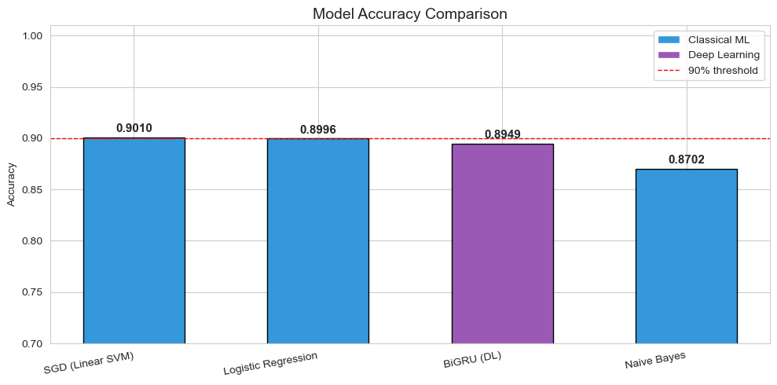
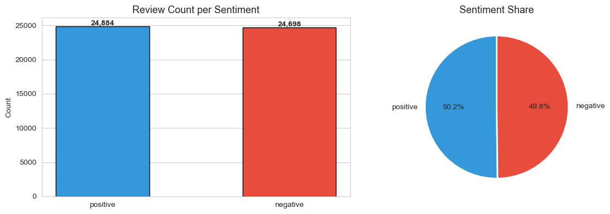
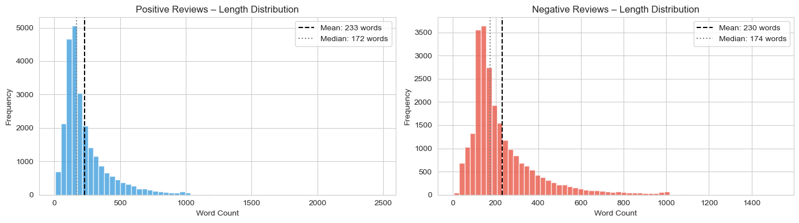
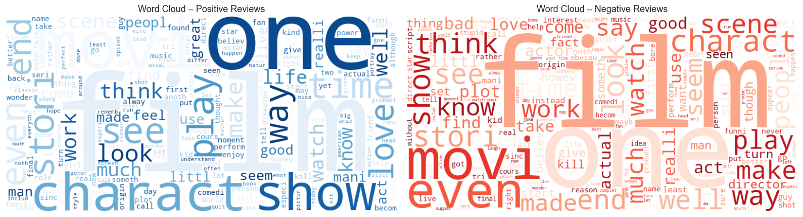
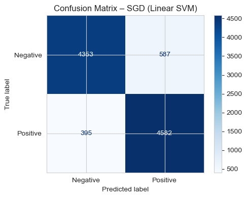
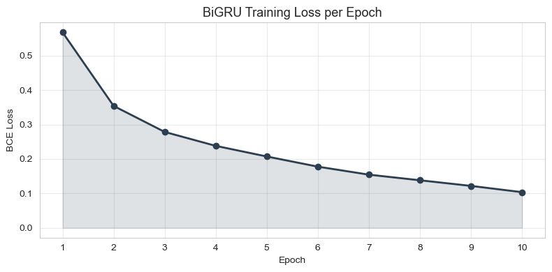

# 🎬 Sentiment Analysis on IMDB Movie Reviews

<div align="center">


**Binary sentiment classification on 50,000 IMDB movie reviews using classical ML and deep learning.**  
Four models benchmarked end-to-end: Naive Bayes · Logistic Regression · Linear SVM · Bidirectional GRU

</div>

---

## Results at a Glance

<div align="center">



</div>

| Model | Type | Test Accuracy | Training Time |
|:---|:---|:---:|:---:|
| **SGD – Linear SVM** | Classical ML | **90.10%** ✅ | < 1 min |
| Logistic Regression | Classical ML | 89.96% | ~2 min |
| Bidirectional GRU | Deep Learning | 89.49% | 2 h 34 min (CPU) |
| Naive Bayes | Classical ML | 87.02% | < 1 min |

> Test set: **9,917 samples** · Stratified 80/20 split · 49,582 deduplicated reviews

**Key finding:** TF-IDF bigram features allow classical linear models to match a purpose-built deep learning architecture at 150× lower training cost — confirming that feature quality is often the primary performance driver in text classification.

---


## Pipeline Overview

```
Raw Data  →  Deduplication  →  EDA  →  Preprocessing  →  Feature Engineering  →  Training  →  Evaluation
50K reviews   49,582 unique              HTML · Lower       TF-IDF bigrams           4 models     Accuracy
                                         Tokenise           CountVec (NB)            compared     F1 · CM
                                         Stop-words         Keras Tokeniser          10 epochs    Error analysis
                                         Porter Stem        (BiGRU)                  CPU only
```

---

## Exploratory Data Analysis

<div align="center">



*Perfectly balanced dataset: 25,000 positive / 25,000 negative reviews*

</div>

<div align="center">



*Positive: mean 233 words · Negative: mean 230 words · Max: 2,470 words*

</div>

<div align="center">



*Post-preprocessing word clouds — stop words removed, Porter stemming applied*

</div>

---

## Evaluation

### SGD Confusion Matrix — Best Model

<div align="center">



</div>

The confusion matrix reveals a **precision-recall trade-off** specific to the hinge-loss decision boundary: the SGD classifier achieves the highest negative-class precision (0.92) at the cost of lower recall (0.88). False positives and false negatives are approximately balanced, confirming no systematic class bias.

| Class | Precision | Recall | F1-Score | Support |
|:---|:---:|:---:|:---:|:---:|
| Negative | 0.92 | 0.88 | 0.90 | 4,940 |
| Positive | 0.89 | 0.92 | 0.90 | 4,977 |

### BiGRU Training Dynamics

<div align="center">



</div>

Loss decreases monotonically from **0.5680 → 0.1037** (81.7% reduction) over 10 epochs. No loss spikes observed — gradient norm clipping at `max_norm=1.0` successfully stabilised training across the 2-layer stacked BiGRU.

| Epoch | 1 | 2 | 3 | 4 | 5 | 6 | 7 | 8 | 9 | 10 |
|:---:|:---:|:---:|:---:|:---:|:---:|:---:|:---:|:---:|:---:|:---:|
| BCE Loss | 0.5680 | 0.3542 | 0.2786 | 0.2382 | 0.2073 | 0.1778 | 0.1545 | 0.1382 | 0.1219 | 0.1037 |

---

## Ablation Study

Bigrams contribute **+1.40 percentage points** over unigrams alone:

| Feature Configuration | Test Accuracy | Delta |
|:---|:---:|:---:|
| TF-IDF Unigrams only | 88.70% | — |
| TF-IDF Unigrams + Bigrams | 90.10% | **+1.40 pp** |

Bigrams encode phrase-level patterns ("highly recommend", "not worth", "poorly written") invisible to unigram models.

---

## Model Architecture — Bidirectional GRU

```
Input Sequences  (batch × 400 tokens)
        │
        ▼
Embedding Layer      15,000 vocab × 128 dims
        │
        ▼
BiGRU Layer 1        128 hidden units/direction · dropout=0.3
        │
        ▼
BiGRU Layer 2        128 hidden units/direction
        │
        ▼
Concatenate          forward + backward hidden states  →  256 dims
        │
        ▼
Dropout              p = 0.3
        │
        ▼
Linear(256 → 1) + Sigmoid

Total trainable parameters: 2,414,849
```

**Why BiGRU over LSTM?** Fewer parameters (2 gates vs. 3), faster training, comparable accuracy. Bidirectionality captures context from both ends of a review.

---

## Key Technical Decisions

| Decision | Rationale |
|:---|:---|
| TF-IDF bigrams `(1,2)` | Captures negation ("not recommend"), invisible to unigrams |
| SGD with `loss='hinge'` | Linear SVM equivalent; scales linearly to 50K+ samples |
| Porter Stemming | Reduces vocabulary; faster than lemmatisation at comparable accuracy |
| Sequence cap at 400 tokens | Covers 95%+ of reviews; reduces BiGRU training time significantly |
| Gradient clipping `max_norm=1.0` | Prevents exploding gradients in 2-layer stacked recurrent architecture |
| Stratified 80/20 split | Preserves 50/50 class balance in both train and test partitions |
| `alpha=0.5` for Naive Bayes | Attenuates zero-frequency problem without over-smoothing |

---

## Error Analysis

Three systematic failure modes identified across all models:

| Category | Example Pattern | Root Cause |
|:---|:---|:---|
| **Sarcasm & Irony** | *"Hilarious! What a disaster."* — positive surface, negative intent | No pragmatic inference without world knowledge |
| **Negation ambiguity** | *"not bad"*, *"not a fan but..."* | Bigram has conflicting training signal across classes |
| **Long-range drift** | Positive opening contradicted by negative conclusion (500+ words) | Bag-of-words ignores position; BiGRU partially mitigates |

---

## Future Work

| Improvement | Addresses | Expected Gain |
|:---|:---|:---|
| GloVe / fastText embeddings | Weak semantic representation in BiGRU | Better synonyms, rare words |
| Sentence-level attention | Long-range sentiment drift | ~1–2 pp improvement |
| BERT / RoBERTa fine-tuning | Sarcasm, irony, negation | Expected accuracy > 95% |
| Cross-domain evaluation | Domain-limited generalisation | Quantified robustness |
| Aspect-based sentiment | Coarse binary output | Fine-grained per-aspect insights |

---

## Setup

```bash
# 1. Install dependencies
pip install pandas numpy scikit-learn nltk torch tensorflow \
            matplotlib seaborn wordcloud jupyter

# 2. Download NLTK resources
python -c "import nltk; nltk.download('punkt'); nltk.download('stopwords')"

# 3. Download dataset from Kaggle and place IMDB Dataset.csv in this folder
#    https://www.kaggle.com/datasets/lakshmi25npathi/imdb-dataset-of-50k-movie-reviews

# 4. Run the notebook
jupyter notebook imdb_sentiment_analysis_submission.ipynb
```

> Expected runtime on CPU: ~3 hours (BiGRU training dominates). Classical ML sections complete in under 5 minutes.

---

## References

- Maas et al. (2011). Learning word vectors for sentiment analysis. *ACL 2011*.
- Cho et al. (2014). Learning phrase representations using RNN encoder-decoder. *EMNLP 2014*.
- Popovic et al. (2020). Neural machine translation for Croatian and Serbian. *VarDial Workshop 2020*.
- Devlin et al. (2019). BERT: Pre-training of deep bidirectional transformers. *NAACL-HLT 2019*.
- Liu, B. (2015). *Sentiment Analysis: Mining Opinions, Sentiments, and Emotions*. Cambridge.

---

<div align="center">

**Fatima Ezzahrae Ezzouzi**  
IU International University of Applied Sciences  
DLBAIPNLP01 — Project: Natural Language Processing · June 2026

</div>
